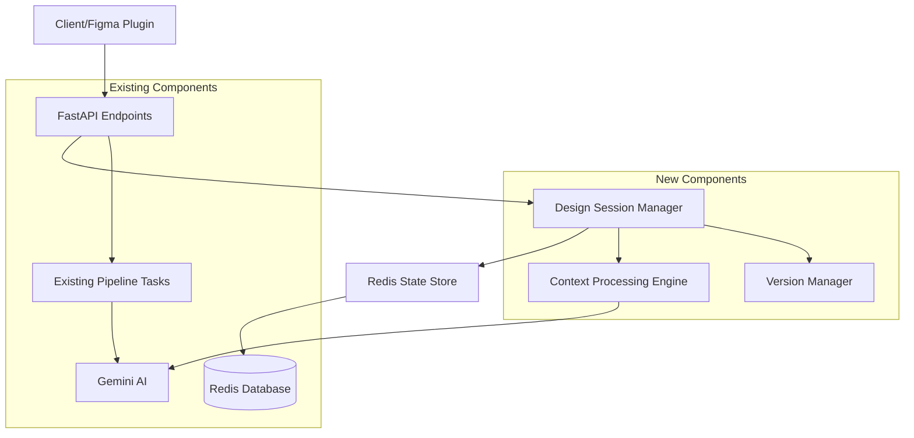
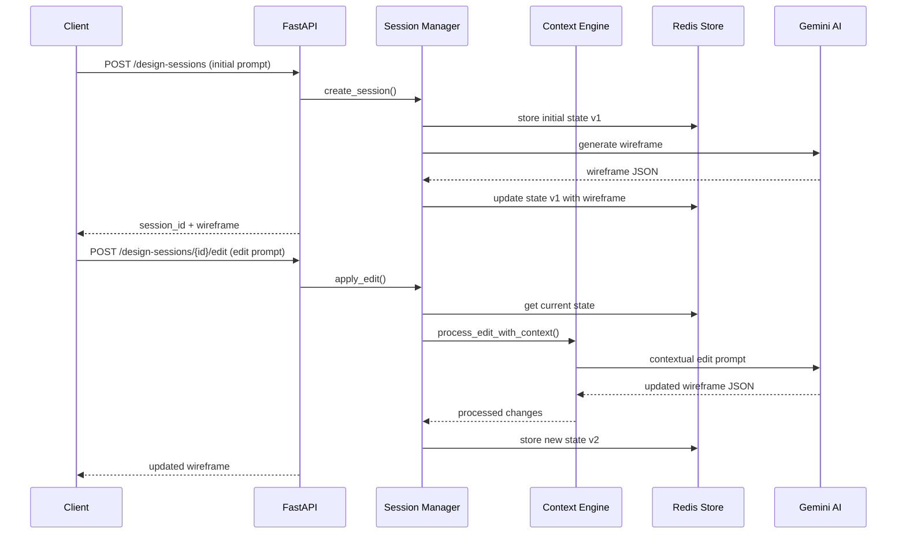

# Design Document: Stateful Iterative Design Engine

## Overview

The Stateful Iterative Design Engine transforms the current one-shot generation workflow into an interactive, conversational design experience. Users can make sequential edits to their UI designs using natural language, with the system maintaining full context and version history throughout the process.

This design builds upon the existing FastAPI + Celery + Redis architecture, adding a new layer of state management and context-aware processing while maintaining backward compatibility with current endpoints.

## Architecture

### High-Level Architecture



### Data Flow for Iterative Edits



## Components and Interfaces

### 1. Design Session Manager

**Purpose:** Central orchestrator for managing design sessions, state transitions, and coordinating between components.

**Key Methods:**
```python
class DesignSessionManager:
    async def create_session(self, user_id: str, initial_prompt: str) -> DesignSession
    async def get_session(self, session_id: str) -> DesignSession
    async def apply_edit(self, session_id: str, edit_prompt: str) -> EditResult
    async def get_session_history(self, session_id: str) -> List[DesignVersion]
    async def cleanup_expired_sessions(self) -> int
```

**Responsibilities:**
- Session lifecycle management
- Coordinating state updates
- Managing session timeouts and cleanup
- Integrating with existing pipeline for code generation

### 2. Context Processing Engine

**Purpose:** Interprets edit prompts in the context of current design state and maintains conversational context.

**Key Methods:**
```python
class ContextProcessingEngine:
    async def process_edit_with_context(
        self, 
        current_state: DesignState, 
        edit_prompt: str, 
        context_history: List[EditContext]
    ) -> ProcessedEdit
    
    def build_contextual_prompt(
        self, 
        base_prompt: str, 
        design_state: dict, 
        recent_changes: List[str]
    ) -> str
    
    def extract_edit_intent(self, prompt: str) -> EditIntent
```

**Responsibilities:**
- Contextual prompt enhancement for Gemini AI
- Intent recognition and disambiguation
- Reference resolution ("it", "the button", etc.)
- Context window management

### 3. Redis State Store

**Purpose:** High-performance storage for design states, session metadata, and version history.

**Data Structures:**
```python
# Redis Keys Pattern
session:{session_id}:metadata     # Session info and current version
session:{session_id}:state:v{n}   # Versioned design states
session:{session_id}:context      # Context history (last 10 interactions)
user:{user_id}:sessions          # User's active sessions
analytics:edits:{date}           # Daily edit metrics
```

**Key Operations:**
```python
class RedisStateStore:
    async def store_design_state(self, session_id: str, version: int, state: DesignState)
    async def get_design_state(self, session_id: str, version: int = None) -> DesignState
    async def get_session_metadata(self, session_id: str) -> SessionMetadata
    async def update_context_history(self, session_id: str, context: EditContext)
    async def cleanup_session(self, session_id: str)
```

### 4. Version Manager

**Purpose:** Handles version tracking, metadata management, and performance optimization for large version histories.

**Key Methods:**
```python
class VersionManager:
    def create_version(self, session_id: str, changes: dict, metadata: dict) -> int
    def get_version_diff(self, session_id: str, from_version: int, to_version: int) -> dict
    def compress_old_versions(self, session_id: str, keep_recent: int = 10)
    def calculate_session_metrics(self, session_id: str) -> SessionMetrics
```

## Data Models

### Core Data Structures

```python
from pydantic import BaseModel
from typing import Dict, List, Optional, Any
from datetime import datetime
from enum import Enum

class EditType(str, Enum):
    MODIFY = "modify"
    ADD = "add"
    REMOVE = "remove"
    STYLE = "style"
    LAYOUT = "layout"

class DesignState(BaseModel):
    wireframe_json: Dict[str, Any]
    metadata: Dict[str, Any]
    created_at: datetime
    version: int

class EditContext(BaseModel):
    prompt: str
    edit_type: EditType
    target_elements: List[str]
    timestamp: datetime
    processing_time_ms: int

class DesignSession(BaseModel):
    session_id: str
    user_id: str
    initial_prompt: str
    current_version: int
    created_at: datetime
    last_activity: datetime
    status: str  # "active", "completed", "expired"

class EditResult(BaseModel):
    success: bool
    new_version: int
    updated_wireframe: Dict[str, Any]
    changes_summary: str
    processing_time_ms: int
    errors: Optional[List[str]] = None

class SessionMetrics(BaseModel):
    total_edits: int
    session_duration_minutes: int
    edit_types_distribution: Dict[EditType, int]
    average_processing_time_ms: float
    user_satisfaction_score: Optional[float] = None
```

### API Request/Response Models

```python
class CreateSessionRequest(BaseModel):
    prompt: str
    user_id: Optional[str] = None

class CreateSessionResponse(BaseModel):
    session_id: str
    wireframe_json: Dict[str, Any]
    version: int

class EditSessionRequest(BaseModel):
    edit_prompt: str

class EditSessionResponse(BaseModel):
    session_id: str
    wireframe_json: Dict[str, Any]
    version: int
    changes_summary: str
    processing_time_ms: int

class SessionHistoryResponse(BaseModel):
    session_id: str
    versions: List[Dict[str, Any]]
    total_versions: int
```

## Error Handling

### Error Categories and Strategies

1. **Redis Connection Failures**
   - Implement circuit breaker pattern
   - Graceful degradation to in-memory state (limited functionality)
   - Clear user messaging about temporary limitations

2. **Context Processing Errors**
   - Fallback to simpler prompt processing
   - Request clarification from user for ambiguous edits
   - Maintain edit history even if context fails

3. **AI Model Failures**
   - Retry with exponential backoff
   - Fallback to previous successful state
   - Queue failed requests for later processing

4. **Session State Corruption**
   - Validate state integrity on retrieval
   - Automatic rollback to last known good version
   - Session recovery mechanisms

### Error Response Format

```python
class IterativeDesignError(BaseModel):
    error_code: str
    message: str
    recoverable: bool
    suggested_action: Optional[str] = None
    session_state: Optional[str] = None  # "preserved", "corrupted", "recovered"
```

## Testing Strategy

### Unit Testing

1. **Context Processing Engine Tests**
   - Intent recognition accuracy
   - Reference resolution correctness
   - Context window management
   - Edge cases for ambiguous prompts

2. **State Management Tests**
   - Redis operations reliability
   - Version integrity and consistency
   - Concurrent session handling
   - Memory usage optimization

3. **Session Manager Tests**
   - Session lifecycle management
   - Cleanup and timeout handling
   - Integration with existing pipeline
   - Error recovery scenarios

### Integration Testing

1. **End-to-End Workflow Tests**
   - Complete iterative design sessions
   - Context preservation across multiple edits
   - Performance under load (50 sequential edits)
   - Integration with code generation pipeline

2. **Performance Testing**
   - Response time requirements (< 5 seconds per edit)
   - Memory usage with large version histories
   - Redis performance under concurrent sessions
   - AI model response time consistency

### Load Testing

1. **Concurrent Sessions**
   - Multiple users with active sessions
   - Redis connection pool management
   - Memory and CPU usage monitoring

2. **High-Frequency Edits**
   - Rapid sequential edits within sessions
   - Context processing performance
   - State consistency under load

## Performance Considerations

### Optimization Strategies

1. **Redis Optimization**
   - Connection pooling for concurrent requests
   - Efficient data serialization (JSON vs MessagePack)
   - TTL-based cleanup for expired sessions
   - Memory usage monitoring and alerts

2. **Context Processing**
   - Limit context window to last 10 interactions
   - Compress older context data
   - Cache frequently accessed design patterns
   - Async processing for non-critical operations

3. **AI Model Efficiency**
   - Prompt optimization to reduce token usage
   - Batch processing for multiple edits
   - Model response caching for similar requests
   - Streaming responses for large designs

### Monitoring and Metrics

1. **Performance Metrics**
   - Edit processing time (target: < 5 seconds)
   - Redis response time (target: < 200ms)
   - Session creation rate and success rate
   - Memory usage per session

2. **Business Metrics**
   - Average edits per session
   - Session completion rate
   - User engagement patterns
   - Feature adoption rates

## Security Considerations

1. **Session Security**
   - Session ID generation using cryptographically secure random
   - Session timeout and automatic cleanup
   - User authentication integration
   - Rate limiting per user/session

2. **Data Privacy**
   - Encryption of sensitive design data in Redis
   - PII detection and masking in prompts
   - Audit logging for data access
   - GDPR compliance for session data

3. **AI Model Security**
   - Input sanitization for edit prompts
   - Output validation for generated content
   - Prompt injection prevention
   - Model response filtering